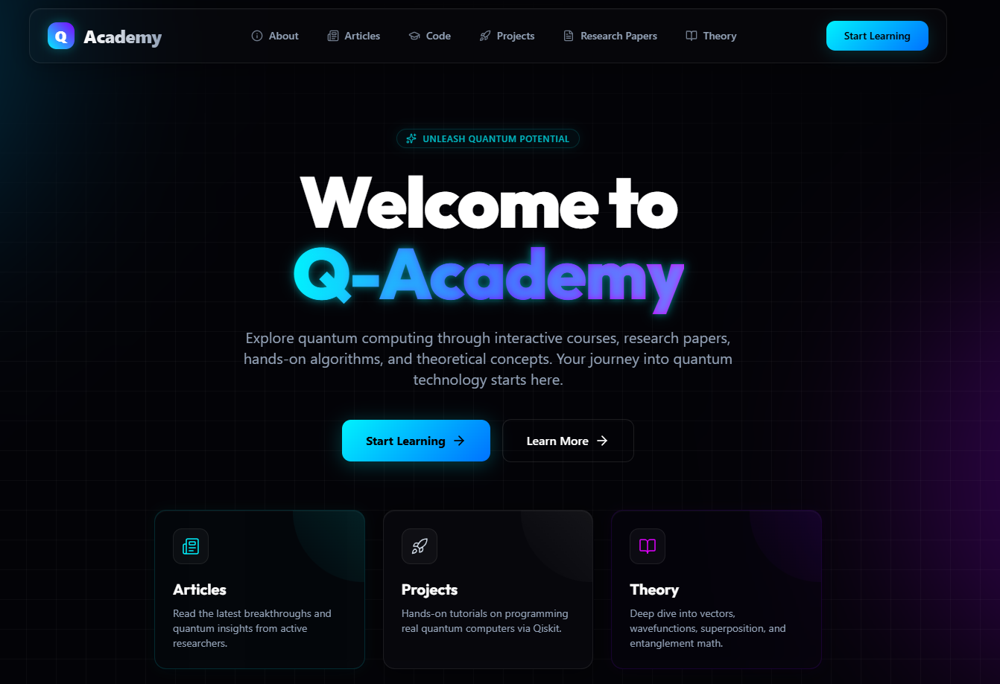

# Q-Academy ⚛️

> **A Comprehensive Platform for Learning Quantum Computing & Programming**

Welcome to **Q-Academy**, an open-source initiative designed to make quantum computing accessible to everyone. Whether you are a complete beginner or looking to deepen your understanding of quantum mechanics and programming, Q-Academy provides a structured learning path, resources, and hands-on projects.



## 🚀 Overview

Q-Academy is built to solve the challenge beginners face when starting with quantum coding. We provide a curated collection of educational materials, from theoretical concepts to practical implementation.

**Status**: 🚧 Active Development
**Deployment**: Deployed on [Cloudflare Pages](https://pages.cloudflare.com/)

## ✨ Key Features

Explore the various sections of our platform:

-   **📚 Learn**: Structured courses and tutorials to guide you from basics to advanced topics.
-   **💡 Concepts**: Deep dives into core quantum computing concepts (Superposition, Entanglement, Qubits, etc.).
-   **📖 Theory**: Theoretical foundations of quantum mechanics essential for programming.
-   **🛠️ Projects**: Hands-on coding projects to apply what you've learned.
-   **📰 Articles**: Insightful articles on the latest trends and breakthroughs in the quantum world.
-   **📄 Research Papers**: Curated list of significant research papers for advanced study.

## 🛠️ Tech Stack

This project is built with a modern, high-performance web stack:

-   **Framework**: [Next.js 15](https://nextjs.org/) (React)
-   **Styling**: [Tailwind CSS](https://tailwindcss.com/)
-   **Language**: [TypeScript](https://www.typescriptlang.org/)
-   **Deployment**: [Cloudflare Pages](https://pages.cloudflare.com/)

## 🏁 Getting Started

Follow these steps to set up the project locally on your machine.

### Prerequisites

Ensure you have the following installed:
-   [Node.js](https://nodejs.org/) (Version 18 or higher recommended)
-   npm (Node Package Manager)

### Installation

1.  **Clone the repository**
    ```bash
    git clone https://github.com/SanaUllah04/Q-Academy.git
    cd Q-Academy
    ```

2.  **Install dependencies**
    ```bash
    npm install
    ```

3.  **Run the development server**
    ```bash
    npm run dev
    ```

    Open [http://localhost:3000](http://localhost:3000) with your browser to see the result.

## ☁️ Deployment

This project is configured for Cloudflare Pages.

### Local Preview (Cloudflare Pages)
To verify how the app will behave on Cloudflare Pages locally:

```bash
# Build the project
npm run pages:build

# Preview the build
npm run pages:preview
```

### Deploy to Cloudflare
To deploy your changes to Cloudflare Pages:

```bash
npm run pages:deploy
```

## 🤝 Contributing

This is an open-source project and we welcome contributions! If you have ideas for new content, bug fixes, or feature improvements:

1.  Fork the repository.
2.  Create a new branch (`git checkout -b feature/AmazingFeature`).
3.  Commit your changes (`git commit -m 'Add some AmazingFeature'`).
4.  Push to the branch (`git push origin feature/AmazingFeature`).
5.  Open a Pull Request.

## 📄 License

This project is licensed under the MIT License - see the [LICENSE](LICENSE) file for details.

---

<p align="center">
  Built with ❤️ by the Quantum Community
</p>
